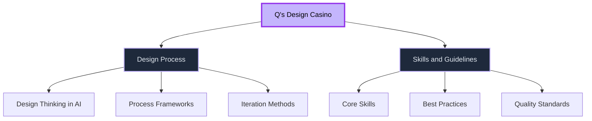

# Q's Design Casino 🎲

> Experimenting with design in the AI space — sharing thoughts, processes, and guidelines

Welcome to my design playground! This is where I explore and document design thinking, processes, and practices in the evolving AI landscape.

## 🗂️ Repository Structure

## 📚 What's Inside

### [Design Process](./design-process)
Exploring design methodologies, frameworks, and approaches for working in the AI space.

### [Skills and Guidelines](./skills-and-guidelines)
Core capabilities, principles, and best practices for creating thoughtful AI-driven experiences.

## 🎯 Purpose

This repository serves as:
- 📝 A living document of design experiments and learnings
- 🧪 A space for testing new approaches to AI design
- 🤝 A resource for others navigating design in AI
- 💭 A place for open thinking about what design means in this space

## 🎰 Why "Design Casino"?

Designing for AI is a bit like a casino — sometimes you win, sometimes you learn. But every experiment teaches us something valuable about what works and what doesn't.

---

*Made with curiosity and experimentation by Q*
