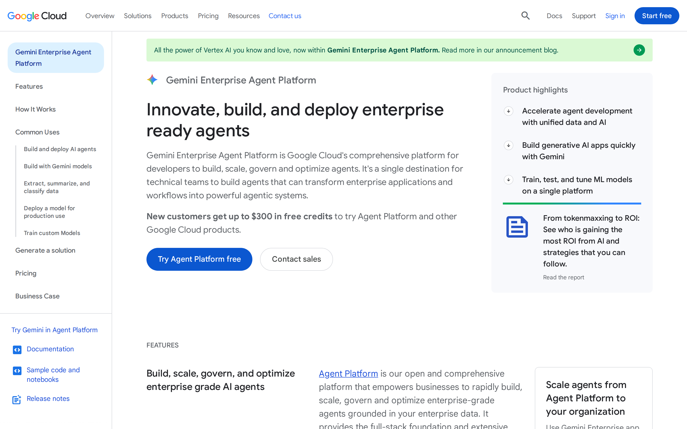

# Google Vertex AI Agent Builder signed-out page: promise clarity audit

## Evaluation summary

**Primary method:** Checked review of singular message, audience alignment, CTA focus, claim specificity, and redundancy  
**Secondary method:** First-impression craft rubric  
**Primary score:** 15/25  
**Craft score:** 26/35  
**Craft verdict:** Solid craft with specific areas to sharpen

The page quickly establishes Vertex AI Agent Builder as an enterprise platform for building AI agents, but it stops short of making one sharply differentiated promise. Search, orchestration, grounding, governance, deployment, and the wider Google Cloud portfolio receive similar emphasis, so the product is understandable as a category while its defining advantage remains less clear.

The visual system is polished and coherent. The larger issue is editorial hierarchy: the page presents a credible collection of capabilities rather than building a focused argument around one memorable outcome.

## Primary evaluation: promise clarity

| Criterion | Score | Assessment |
|---|---:|---|
| Singular message | 3/5 | The opening establishes that the product helps enterprises build AI agents, but the promise expands quickly into a broad platform story covering multiple capabilities and operational concerns. |
| Audience alignment | 4/5 | Enterprise developers, platform teams, and technical decision-makers are clearly addressed through language about scale, security, data, governance, and deployment. |
| CTA focus | 3/5 | The page provides credible next steps, but primary product action, sales contact, documentation, and broader Cloud navigation compete for attention. |
| Claim specificity | 3/5 | Concrete platform concepts add credibility, yet many benefits remain category-level claims that could also describe competing enterprise agent platforms. |
| Redundancy | 2/5 | Build, deploy, scale, ground, and govern themes recur across sections without consistently adding a new layer to the core argument. |

**Total: 15/25**

### Promise clarity verdict

The page answers **what it is** more successfully than **why this product should be chosen**. Its strongest implied promise is that Google provides an enterprise-ready environment for building and operating grounded AI agents. That promise is diluted by the number of adjacent messages presented as coequal benefits.

A tighter version of the page would choose one lead promise, such as secure enterprise agents grounded in organizational data, then organize orchestration, governance, deployment, and model access as supporting proof. This would make the product easier to recall and distinguish without requiring the page to remove important platform capabilities.

## First-impression craft rubric

| Dimension | Weight | Score | Weighted score | Rationale |
|---|---:|---:|---:|---|
| Visual hierarchy | 1x | 4 | 4 | The product category, main proposition, and primary actions are identifiable quickly, though the broader Cloud interface and secondary choices reduce singular focus. |
| Information density | 1x | 3 | 3 | Individual sections are orderly, but the full page accumulates enough capability blocks, proof points, and pathways that signal begins to compete with coverage. |
| Readability | 1x | 4 | 4 | Clear type hierarchy, restrained line lengths, and strong contrast support scanning, even when enterprise terminology makes the copy conceptually dense. |
| Coherence | 2x | 4 | 8 | Consistent typography, spacing, components, and visual language make the page feel unified within the Google Cloud design system. |
| Durability | 1x | 4 | 4 | The modular layout should accommodate moderate changes in copy and section count, although repeated card structures could become monotonous with expansion. |
| Intentionality | 1x | 3 | 3 | Most interface decisions are polished, but the equal treatment of many capabilities suggests template and portfolio requirements are shaping the experience as much as a deliberate product narrative. |

**Weighted total: 26/35**

This places the page in the **solid craft with specific areas to sharpen** range.

## Detailed findings

### The category is clear, but the promise is broad

The opening gives users enough information to recognize an enterprise agent-building platform. That is a meaningful success for a technically complex product. However, the message relies on a sequence of broad verbs and platform attributes rather than a single outcome users can retain.

The page would be stronger if the hierarchy followed a strict sequence:

1. One differentiated customer outcome.
2. One sentence defining the product.
3. Three supporting capabilities.
4. Evidence that Google can deliver those capabilities at enterprise scale.

Instead, the page moves quickly from the product-level proposition into the breadth of the platform.

### Enterprise alignment is strong

The language and proof structure are suited to organizations evaluating production infrastructure rather than individuals experimenting with lightweight agent tools. Security, governance, grounding, scale, and deployment considerations establish an enterprise posture.

The weakness is not audience ambiguity. It is the attempt to address developers, platform owners, security stakeholders, data leaders, and buyers within the same level of hierarchy. Role-specific needs are present, but they are not always sequenced around one primary reader.

### CTAs represent multiple journeys

A technical platform reasonably needs routes for trying the product, contacting sales, and reading documentation. The page makes those routes available, but it does not clearly subordinate them to one dominant next step.

The CTA model should distinguish between:

- **Primary:** Begin building or evaluate the product directly.
- **Secondary:** Contact sales for enterprise adoption.
- **Tertiary:** Explore documentation and supporting resources.

This distinction should remain consistent in the hero, navigation, and closing section.

### Specific capabilities need a sharper competitive frame

References to grounding, orchestration, governance, deployment, and Google Cloud integration make the product sound credible. They do not consistently explain what Google does uniquely or measurably better.

Claim specificity could improve through:

- Clear descriptions of proprietary advantages.
- Quantified performance, deployment, or operational outcomes.
- Named integrations tied to concrete use cases.
- Customer evidence connected directly to the lead promise.
- Explicit distinctions between Agent Builder and adjacent Vertex AI services.

### Repetition adds length more often than proof

Repeated messaging can reinforce a complex proposition, but each repetition should advance the argument. On this page, recurring build, scale, and governance language sometimes restates platform breadth without adding evidence or resolving a new customer concern.

A useful editorial test is to assign every section one role: define, demonstrate, prove, compare, or convert. Sections that perform the same role with similar claims should be consolidated.

## Priority recommendations

### 1. Commit to one lead promise

Frame the page around one specific outcome rather than the total surface area of the platform. Enterprise agents grounded in trusted organizational data is a stronger organizing idea than a broad list of agent-building capabilities.

### 2. Turn platform breadth into supporting proof

Search, orchestration, governance, deployment, models, and integrations should validate the lead promise. They should not read as six parallel reasons to understand the product.

### 3. Establish one dominant CTA

Choose the most valuable signed-out action and give it persistent visual priority. Keep sales and documentation available, but clearly secondary.

### 4. Reduce repeated capability language

Consolidate sections that restate build, deploy, scale, and govern themes. Use the recovered space for demonstrations, quantified evidence, or a concise explanation of product architecture.

### 5. Clarify the product boundary

Explain how Agent Builder relates to Vertex AI, models, search, data services, and other Google Cloud products. A simple architecture or responsibility model would reduce the sense that the page is cross-selling the broader portfolio.

## Patterns worth borrowing

- A polished enterprise visual system with consistent typography, spacing, and component behavior.
- Immediate category recognition in the opening section.
- Strong alignment with enterprise concerns such as governance, security, grounding, and scale.
- Modular sections that support scanning and accommodate complex product material.
- Multiple evaluation pathways for technical users, buyers, and existing Cloud customers.

## Anti-patterns to avoid

- Treating every platform capability as part of the primary promise.
- Using broad enterprise claims without enough quantified or comparative evidence.
- Giving product trial, sales, documentation, and portfolio navigation similar prominence.
- Repeating build, deploy, scale, and govern language without advancing the argument.
- Allowing the parent portfolio narrative to obscure the product’s specific boundary and advantage.
- Equating comprehensive coverage with message clarity.

*Status: auto-scored*
---

## Human review

Reviewed:

| Dimension | Auto-score | Human score | Note |
|-----------|-----------|-------------|------|
| Visual hierarchy | /5 | | |
| Information density | /5 | | |
| Readability | /5 | | |
| Coherence (2x) | /5 | | |
| Durability | /5 | | |
| Intentionality | /5 | | |
| **Total** | **/35** | | |

### Verdict

[ ] Confirmed / [ ] Needs revision

---

*Scoring model: gpt-5.6-sol*
*Status: auto-scored, pending human review*