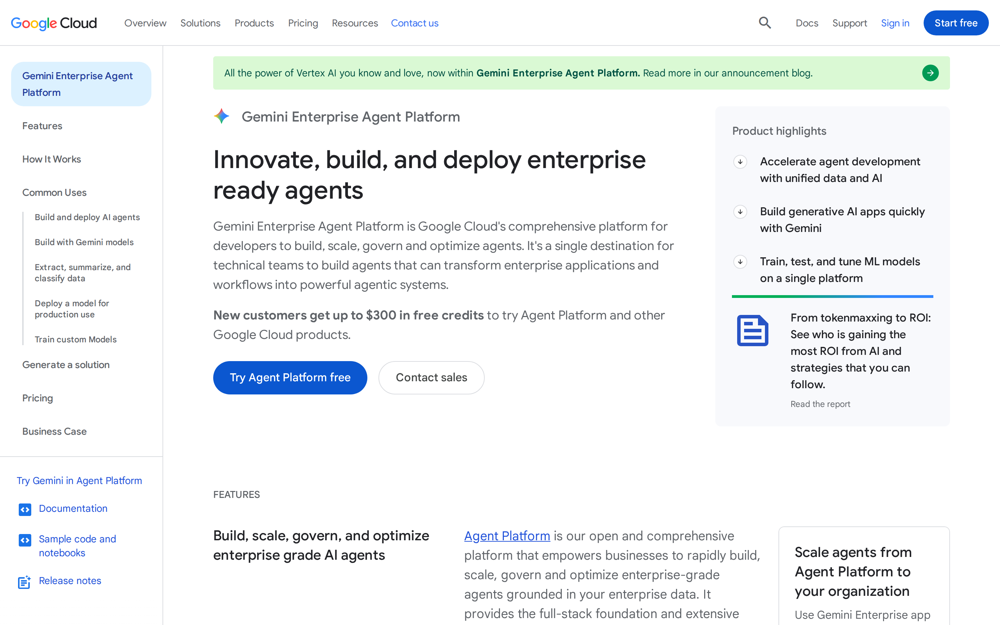

# Google Vertex AI Agent Builder signed-out page: trust architecture

## Evaluation summary

**Primary trust architecture score:** 19/25  
**Secondary craft score:** 27/35  
**Craft verdict:** Solid craft with specific areas to sharpen.

Vertex AI Agent Builder presents a credible enterprise platform through clear product framing, familiar Google Cloud design language, and repeated emphasis on grounding, deployment, security, and governance. The page is strongest when explaining the breadth of the platform and weakest when converting Google’s inherited credibility into concrete, independently verifiable proof.

The main opportunity is not to add more trust language. It is to place sharper evidence closer to the claims it supports, particularly around customer outcomes, data handling, operational requirements, pricing, and Google Cloud dependency.

## Evidence and scope

This evaluation treats the bet’s checked review as the primary method and the first-impression craft rubric as a secondary lens. It evaluates the signed-out experience, not the quality of the product after authentication.

The supplied text extraction is dominated by application bootstrap code, so it was not treated as visible page content. The assessment instead references the rendered page captures.

The above-the-fold experience establishes the product category, enterprise positioning, and primary action quickly. Google Cloud branding supplies immediate institutional credibility, although the hero relies more on that authority than on specific proof.

The full page builds trust cumulatively through capability explanation, enterprise controls, ecosystem breadth, and supporting resources. Its length and modular repetition make the argument comprehensive, but less decisive than it could be.

## Primary evaluation: trust architecture

| Criterion | Score | Finding |
|---|---:|---|
| Sequence | 4/5 | The page moves logically from enterprise promise to platform capabilities, risk controls, supporting proof, and action, although some of the strongest reassurance arrives after substantial scrolling. |
| Specificity | 4/5 | References to grounding, model and tool access, deployment, security, and governance make the proposition materially more credible than a generic agent-platform claim. |
| Social proof quality | 3/5 | Google Cloud’s reputation provides strong ambient trust, but the page relies more on institutional authority and ecosystem scale than on quantified customer outcomes tied to specific claims. |
| Friction to first action | 4/5 | The primary action is visible and paired with a sales-oriented path, but the likely need for a Google Cloud account, project configuration, permissions, and billing is not made equally clear. |
| Risk reduction | 4/5 | Enterprise controls and grounding address major adoption concerns, while pricing exposure, data-flow boundaries, deployment prerequisites, and platform dependency remain comparatively under-explained. |
| **Total** | **19/25** | **The page maintains trust effectively through platform credibility and enterprise controls, but it stops short of making every major adoption risk inspectable before action.** |

## Trust architecture findings

### Sequence

The trust argument is structurally sound. The page first establishes that Agent Builder is an enterprise platform rather than a narrow prototyping tool, then expands into the capabilities needed to build, ground, deploy, and govern agents.

This sequencing matches the concerns of a serious evaluator:

1. What can the platform do?
2. What models, data, and tools can it use?
3. Can it operate against enterprise data safely?
4. Can teams deploy and govern it?
5. What is the next step?

The weakness is distance. Security, governance, and operational reassurance are central to the buying decision, but they compete with a long capability narrative. A compact trust summary near the hero would reduce the need to assemble the risk story across multiple sections.

### Specificity

The page earns credibility by naming enterprise mechanisms rather than relying only on abstract claims about intelligence or productivity. Grounding, data connectivity, orchestration, deployment, and governance collectively imply a system intended for production use.

This specificity also distinguishes the offer from standalone model access. The product is framed as an agent platform inside Google Cloud, with the infrastructure, data, and control layers that positioning entails.

However, several assurances would be stronger if they resolved practical questions directly:

- Which controls apply by default, and which require configuration?
- How are model and data choices constrained by region or service?
- What telemetry is retained?
- What changes when third-party models or tools are used?
- Which capabilities are generally available, previewed, or separately priced?

### Social proof quality

Google enters with unusually strong inherited credibility. The visual system, Cloud branding, platform breadth, and association with established infrastructure all reduce perceived vendor risk before the visitor reads deeply.

That advantage also creates a blind spot. Brand authority is not a substitute for product-specific evidence. The page would make a stronger case with proof modules that connect a named customer, a concrete agent workflow, a measurable result, and the relevant Agent Builder capability.

A stronger proof unit would answer four questions in one place:

- Who deployed it?
- What did the agent do?
- What operational or business result changed?
- Which platform controls made the deployment acceptable?

### Friction to first action

The page makes the next action easy to find and supports both self-directed and sales-assisted intent. This is appropriate for a product serving developers, platform teams, and enterprise buyers.

The visible interaction cost is low, but the probable system cost is higher. Starting with a cloud AI platform can involve account creation, project selection, API enablement, access policies, regional decisions, quota, and billing. The page does not fully preview that path.

A short “What you need to start” panel would preserve momentum while setting accurate expectations.

### Risk reduction

The page addresses several of the most important agent-platform risks:

- Grounding agents in enterprise data
- Controlling deployment and operation
- Governing agents at organizational scale
- Integrating with an established cloud environment
- Building on a recognizable security and infrastructure foundation

The remaining gap is explicitness. The page signals that Google Cloud can manage risk, but does not always show the boundary conditions behind that claim. Buyers still need concise answers about data residency, model-provider differences, observability, evaluation, human oversight, failure handling, pricing, and lock-in.

The trust architecture is therefore strong at reassurance and moderate at inspectability.

## Secondary evaluation: first-impression craft

| Dimension | Weight | Score | Weighted score | Rationale |
|---|---:|---:|---:|---|
| Visual hierarchy | 1x | 4 | 4 | The product promise and primary action are apparent within seconds, although global Cloud navigation and secondary paths slightly dilute the hero’s focus. |
| Information density | 1x | 3 | 3 | Most sections contribute useful substance, but the long sequence of capability modules creates repetition and makes the strongest evidence harder to isolate. |
| Readability | 1x | 4 | 4 | Familiar typography, restrained color, clear spacing, and modular headings support scanning, with some dense enterprise terminology increasing the reading burden. |
| Coherence | 2x | 4 | 8 | The page consistently uses Google Cloud’s layout, type, color, cards, and interaction patterns, although repeated template modules occasionally feel more systematic than editorially composed. |
| Durability | 1x | 4 | 4 | The grid and component system should tolerate moderate copy and feature changes, but several card groups could become uneven if content length expands substantially. |
| Intentionality | 1x | 4 | 4 | The major design choices reinforce enterprise credibility and platform breadth, while some repeated sections appear inherited from the broader Cloud page system rather than tailored to this trust narrative. |
| **Total** | **7x** |  | **27** | **The page is visually disciplined and resilient, but its modular density keeps it below exceptional craft.** |

## Craft verdict

At **27/35**, the page falls in the rubric’s **solid craft with specific areas to sharpen** range.

Its first impression benefits from a mature design system, restrained visual language, and predictable interaction patterns. These choices are particularly effective for enterprise AI, where clarity and stability are more valuable than novelty.

The page does not reach exceptional craft because the full-page composition feels cumulative rather than tightly edited. Too many modules share similar visual weight, so capability explanation, customer evidence, governance reassurance, and supporting resources can blend into one extended stream.

## Priority improvements

### 1. Put a compact trust layer near the hero

Add a concise proof strip covering grounding, model choice, governance, security, and deployment. Each item should link to a precise explanation rather than repeat a broad benefit.

### 2. Tie proof directly to claims

Pair major claims with named customer outcomes, technical documentation, control descriptions, or deployment evidence. Avoid separating promotional statements from the material needed to verify them.

### 3. Explain the activation path before the click

State the requirements for starting, including Google Cloud account status, project setup, billing, permissions, regional availability, and any preview limitations.

### 4. Make Cloud dependency explicit

Present Google Cloud integration as a deliberate tradeoff. Explain what customers gain from the dependency, what remains portable, and which services or controls are required.

### 5. Reduce repeated module weight

Condense overlapping capability sections and give greater visual prominence to decision-critical evidence. The page should make risk resolution easier to scan than feature breadth.

## Patterns worth borrowing

- Lead with a clear enterprise outcome rather than an abstract AI slogan.
- Use a restrained, familiar visual system to communicate operational stability.
- Present grounding, deployment, security, and governance as parts of one platform story.
- Support both self-directed exploration and sales-assisted evaluation.
- Build trust cumulatively across product capability, infrastructure, controls, and documentation.
- Keep primary actions visually consistent throughout a long page.

## Anti-patterns to avoid

- Treating a strong parent brand as sufficient product-specific proof.
- Placing important security and governance reassurance too far below the initial promise.
- Using customer logos or broad testimonials without measurable deployment outcomes.
- Hiding account, billing, permission, and infrastructure requirements behind the primary action.
- Repeating similarly weighted capability modules until proof and promotion become difficult to distinguish.
- Framing cloud dependency only as an advantage without explaining constraints, portability, or cost implications.

Status: auto-scored
---

## Human review

Reviewed:

| Dimension | Auto-score | Human score | Note |
|-----------|-----------|-------------|------|
| Visual hierarchy | /5 | | |
| Information density | /5 | | |
| Readability | /5 | | |
| Coherence (2x) | /5 | | |
| Durability | /5 | | |
| Intentionality | /5 | | |
| **Total** | **/35** | | |

### Verdict

[ ] Confirmed / [ ] Needs revision

---

*Scoring model: gpt-5.6-sol*
*Status: auto-scored, pending human review*