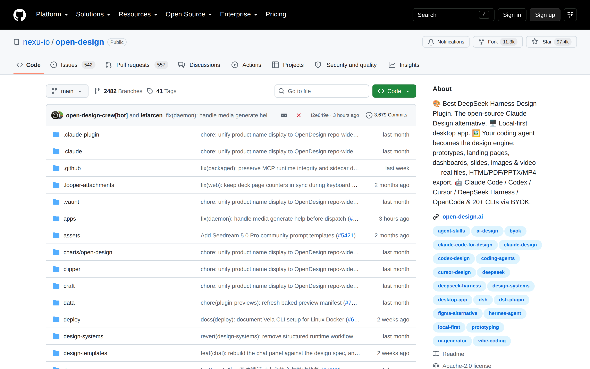

# Design-system integrity evaluation: `nexu-io/open-design`

## Evaluation scope

**Bet:** Prevent Question card required marker from wrapping with long copy  
**Theme:** Design-system integrity  
**Primary method:** Judged, holistic evaluation  
**Secondary method:** First-impression craft rubric  
**Success threshold:** 75%, equivalent to **26.25 out of 35**

This review evaluates the signed-out GitHub repository page as the supplied representative product surface. The extracted HTML does not expose the referenced Question card or a visible required marker, so the bet’s narrow wrapping behavior cannot be verified directly. The judgment therefore focuses on the broader system qualities that govern such a component: semantic grouping, responsive behavior, hierarchy, consistency, and resilience under longer content.

## Evidence

## Executive verdict

**Score: 27 out of 35, or 77.1%.**

**Result: Passes the initial 75% threshold.**

The page demonstrates solid system craft through GitHub’s mature shell, consistent component language, theme support, accessibility settings, and predictable repository conventions. Its main weakness is local information density: the global navigation, repository controls, metadata, and project-authored content compete for attention before the project’s value becomes clear.

For the specific bet, the available evidence is **inconclusive**. The page provides credible evidence of a mature design system, but it does not show the Question card at relevant widths or prove that its required marker remains attached to the associated label. This distinction matters because system-level polish cannot substitute for testing the exact failure state.

## Primary judged evaluation

### Overall judgment

The experience generally communicates competence and trust. GitHub’s familiar visual grammar makes navigation and interaction behavior predictable, while the repository content sits within a stable framework of tabs, buttons, labels, metadata, and responsive containers. That foundation supports clarity and craft.

The experience is less successful as a focused product introduction. The signed-out global header carries substantial navigational weight, and the repository title and description are unusually long. This creates a dense first impression in which platform chrome and project messaging compete rather than form a single decisive hierarchy.

### Clarity

The page clearly identifies itself as a GitHub repository and exposes expected repository actions. However, the project proposition contains many claims, tools, formats, and emoji markers in one title and description. Users can identify the repository quickly, but understanding its primary product promise takes longer than three seconds.

### Trust

Trust is supported by established GitHub patterns, visible repository provenance, standard navigation, theme controls, and accessible link behavior. The project’s long, promotional description slightly weakens that trust signal because it reads more like keyword accumulation than disciplined product positioning.

### Craft

The surrounding system is highly crafted. Reusable primitives, consistent spacing, defined color modes, high-contrast themes, and conventional control treatments indicate deliberate system design. Local content composition is less refined, especially where long copy pushes the limits of compact repository-header structures.

### Decision on the bet

**Threshold decision:** Pass at the page level, with a required follow-up for the component-level claim.

**Component claim:** Not demonstrated.

The bet should not be marked fully validated until the required marker is tested in the actual Question card across realistic and adversarial content lengths. A judged review can confirm whether the result feels coherent, but marker attachment and wrapping behavior should also be enforced mechanically.

## What design judgment can be made explicit?

The required marker should read as part of the field label, not as an independent token. It should remain visually adjacent to the end of the label text, preserve its baseline relationship, and never appear alone at the beginning of a new line.

A useful explicit judgment is:

> When a label wraps, the required marker must remain attached to the final visible word or semantic label unit, without creating awkward spacing, clipping, overlap, or a misleading orphaned marker.

This judgment covers more than technical non-wrapping. It also protects comprehension and trust. A detached asterisk can be mistaken for a footnote, decoration, or an unrelated validation state.

## What can be checked mechanically?

The following checks are suitable for automated visual, DOM, or layout testing:

- The marker and the final label token do not separate across lines.
- The marker never occupies a line by itself.
- The marker remains visible and is not clipped by overflow.
- The marker does not overlap text, controls, or card boundaries.
- The label container supports long unbroken strings without horizontal overflow.
- Card width remains within its parent at supported breakpoints.
- Line-height and marker alignment remain stable at browser zoom levels such as 200%.
- The behavior holds in narrow mobile widths, translated copy, and increased text-size settings.
- The required state is exposed semantically, such as `aria-required="true"` or the appropriate native form attribute.
- The marker is not the only means of communicating that the field is required.

A robust implementation would keep the final word and marker in an inline non-breaking wrapper, rather than applying `white-space: nowrap` to the entire label. Preventing wrapping across the full label would create a different failure mode.

## What still needs experiential judgment?

Human review is still necessary to determine whether:

- The final line looks balanced rather than artificially stretched or cramped.
- The marker feels attached to the label without colliding with punctuation.
- The visual treatment remains clear across light, dark, and high-contrast themes.
- The required state is noticeable without becoming disproportionately loud.
- Dense cards remain scannable when several labels wrap.
- Localization produces natural line breaks.
- The solution feels consistent with other labels and validation patterns in the design system.
- The card remains composed when copy grows or shrinks by 30%.

## What would make this lens reusable?

Turn the bet into a reusable **semantic attachment and wrap integrity** check for compact UI components. Apply it to required markers, status badges, units, counts, external-link icons, disclosure indicators, keyboard shortcuts, and inline help affordances.

A reusable review stack should include:

1. **Semantic attachment:** Does the accessory clearly belong to the correct text?
2. **Wrap behavior:** Can the accessory become orphaned at any supported width?
3. **Overflow behavior:** Do long words, localization, or zoom cause clipping or overlap?
4. **Accessibility:** Is meaning preserved without relying on position, color, or symbol alone?
5. **System consistency:** Does the component behave like equivalent patterns elsewhere?
6. **Visual composition:** Does the wrapped result still look intentional?
7. **Content resilience:** Does the design tolerate at least 30% copy variation?

## Craft rubric score

| Dimension | Weight | Score | Weighted score | Rationale |
|---|---:|---:|---:|---|
| Visual hierarchy | 1x | 4 | 4 | Repository identity and standard actions are easy to locate, but the expansive signed-out navigation and long project description delay a singular primary message. |
| Information density | 1x | 3 | 3 | Platform navigation, repository metadata, controls, and promotional project copy all earn some utility, yet too many compete at once in the initial viewport. |
| Readability | 1x | 4 | 4 | Primer typography, contrast modes, spacing, and familiar control patterns support scanning, while the exceptionally long title and description increase reading effort. |
| Coherence | 2x | 5 | 10 | The page uses a unified GitHub design language across navigation, repository controls, themes, states, and content containers. |
| Durability | 1x | 3 | 3 | The responsive system is mature, but the supplied long copy visibly represents a stress case and the required-marker behavior is not available to verify. |
| Intentionality | 1x | 3 | 3 | Most platform choices have clear functional reasons, but the project-level accumulation of emoji, claims, and tool names feels insufficiently edited. |
| **Total** | **7x** |  | **27** | **77.1%, solid craft with specific areas to sharpen.** |

## Score interpretation

At **27 out of 35**, the page falls within **solid craft with specific areas to sharpen**. The score clears the bet’s 75% threshold by 2.1 percentage points.

The strongest attribute is coherence. The weakest areas are density, durability, and intentionality. Those weaknesses are directly relevant to the bet because long-copy failures typically emerge when compact components are designed around ideal content rather than treated as resilient system primitives.

## Priority recommendations

1. **Test the exact Question card failure state.** Capture long labels at minimum, common, and narrow widths, including a case where only the marker would otherwise wrap.
2. **Bind only the marker to the final semantic text unit.** Do not disable wrapping for the entire label.
3. **Add automated regression coverage.** Include viewport, zoom, localization, and long-token cases.
4. **Verify semantic required-state communication.** The visual marker should reinforce, not replace, programmatic and textual meaning.
5. **Reduce project-header copy density.** Prioritize one product claim, then move tool coverage and export formats into structured secondary content.
6. **Review the component in every supported theme.** Include light, dark, high-contrast, and color-vision variants where applicable.
7. **Define a system rule for inline accessories.** Use the same attachment behavior for markers, units, badges, counts, and icons.

## Patterns worth borrowing

- A consistent component language across navigation, tabs, buttons, labels, and repository controls.
- Built-in light, dark, high-contrast, and color-vision theme support.
- Familiar interaction patterns that reduce the need for instruction.
- Responsive containers and reusable primitives rather than one-off page styling.
- Visible focus on accessibility settings and underlined links.
- Clear separation between global platform navigation and repository-level navigation.
- Semantic structure that can support mechanical regression testing.

## Anti-patterns to avoid

- Treating overall system polish as proof that a specific edge case is solved.
- Allowing a required marker to wrap independently from its label.
- Applying `white-space: nowrap` to an entire long label.
- Using an asterisk as the only indication that a field is required.
- Packing the primary description with too many claims, integrations, formats, and emoji.
- Testing only ideal English copy at one desktop width.
- Relying solely on screenshots without DOM, accessibility, zoom, and localization checks.
- Declaring the component-level bet successful when the representative artifact does not contain the component.

_Status: auto-scored_
---

## Human review

Reviewed:

| Dimension | Auto-score | Human score | Note |
|-----------|-----------|-------------|------|
| Visual hierarchy | ?/5 | | |
| Information density | ?/5 | | |
| Readability | ?/5 | | |
| Coherence (2x) | ?/5 | | |
| Durability | ?/5 | | |
| Intentionality | ?/5 | | |
| **Total** | **/35** | | |

### Verdict

[ ] Confirmed / [ ] Needs revision

---

*Scoring model: gpt-5.6-sol*
*Status: auto-scored, pending human review*